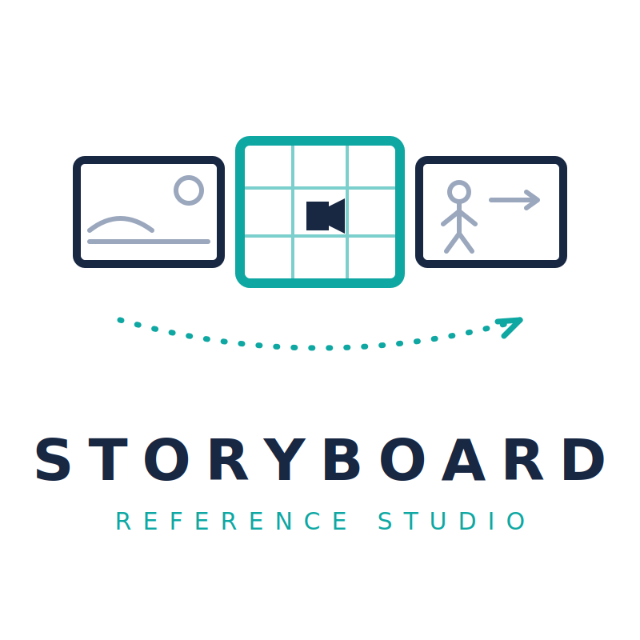

# Wasserman's Filmmaker Suite

**Four desktop apps for AI-native filmmaking — from first blocking to final mix.**

Plan the shot, match real motion, board the look, and split the sound. Each app stands alone; together they cover the whole previs-to-post loop around modern video generators.

---

<table>
<tr>
<td width="50%" align="center">

### [Blockout](https://github.com/wassermanproductions/blockout)

**Previs.** Stage a scene in minutes, choreograph camera and cast against marks the way real sets work, and export a motion-reference package (video + depth pass + stills + tailored prompt) that Seedance, Veo, Kling, LTX, and Wan can't misread.

[Repo](https://github.com/wassermanproductions/blockout) · [Download](https://github.com/wassermanproductions/blockout/releases) — macOS &amp; Windows 11

</td>
<td width="50%" align="center">

### [Motion Previs Studio](https://github.com/wassermanproductions/motion-previs-studio)

**Motion capture from footage.** Turn any clip into usable previs data — pose extraction (OpenPose/ControlNet-ready), camera solve, depth — and hand the result straight to Blockout as a reference underlay.

[Repo](https://github.com/wassermanproductions/motion-previs-studio) · [Download](https://github.com/wassermanproductions/motion-previs-studio/releases)

</td>
</tr>
<tr>
<td width="50%" align="center">

### [Storyboard Reference Studio](https://github.com/wassermanproductions/storyboard-reference-studio)

**Boards and prompts.** Ingest images or video, auto-board with scene detection, crop to your aspect, and export per-frame stills with generator-ready prompts (Midjourney, Flux, SDXL, and more).

[Repo](https://github.com/wassermanproductions/storyboard-reference-studio) · [Download](https://github.com/wassermanproductions/storyboard-reference-studio/releases)

</td>
<td width="50%" align="center">

### [Stem Studio](https://github.com/wassermanproductions/stem-studio)

**Sound.** Split a married mix into sample-aligned dialogue, music, and effects stems — NLE-ready WAVs or a multitrack MOV — entirely on your machine.

[Repo](https://github.com/wassermanproductions/stem-studio) · [Download](https://github.com/wassermanproductions/stem-studio/releases)

</td>
</tr>
</table>

---

## How they fit together

1. **Blockout** — block the scene, choreograph camera and cast, export the motion reference.
2. **Motion Previs Studio** — pull real motion and camera moves from footage; send references into Blockout.
3. **Storyboard Reference Studio** — turn references into boards and per-frame prompts for your image generator.
4. **Stem Studio** — when the cut comes back, split temp mixes and delivered audio into clean stems.

Every app is **agent-drivable**: each ships an MCP server, so Claude Code, Codex, Hermes, or any MCP client can stage scenes, run analyses, and pull exports for you. See each repo's `mcp/README.md`.

## Platforms

All four apps run on macOS (Apple Silicon). **Blockout also ships a native Windows 11 installer**, with Windows support for the rest of the suite merged and heading toward release.

---

All apps are open source under **Apache-2.0**.

Created by **Sam Wasserman** — [wassermanproductions.com](https://wassermanproductions.com) · [wasserman.ai](https://wasserman.ai)

Windows support contributed and maintained by **Gumbii Digital** ([github.com/GumbiiDigital](https://github.com/GumbiiDigital)).

